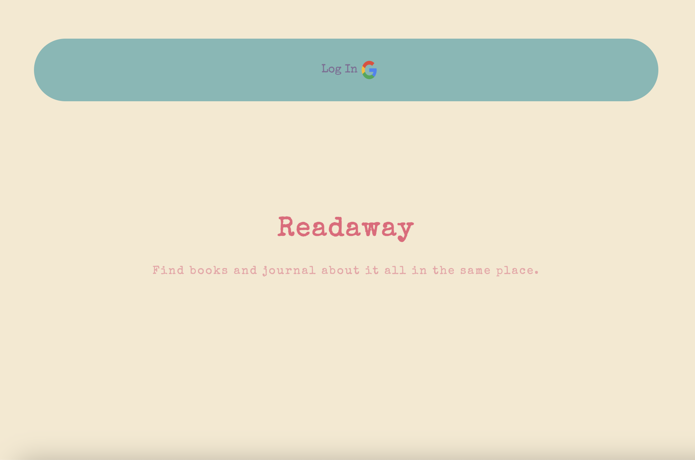
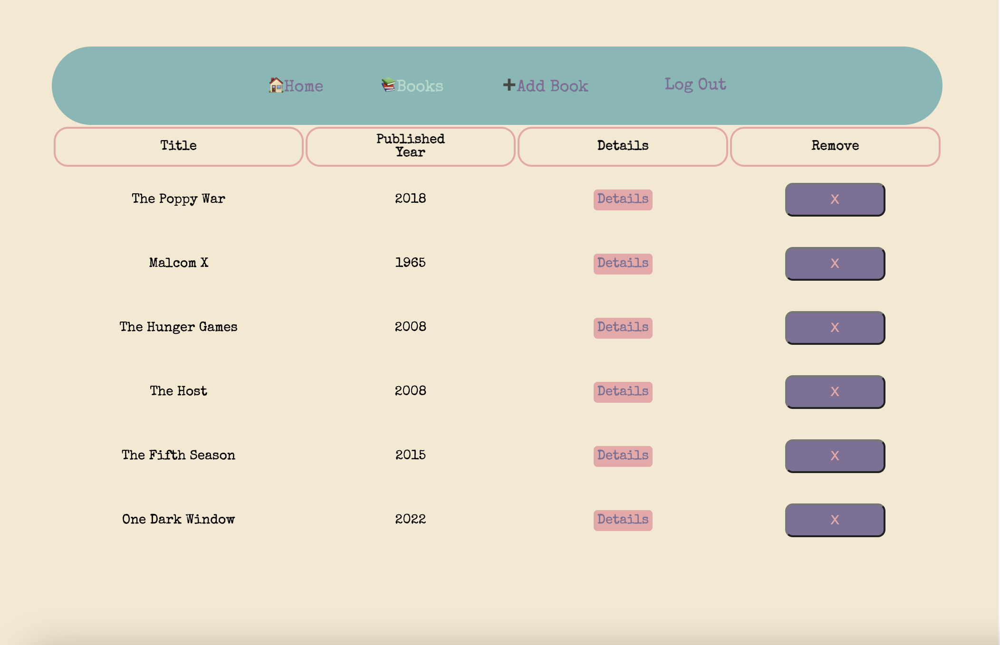
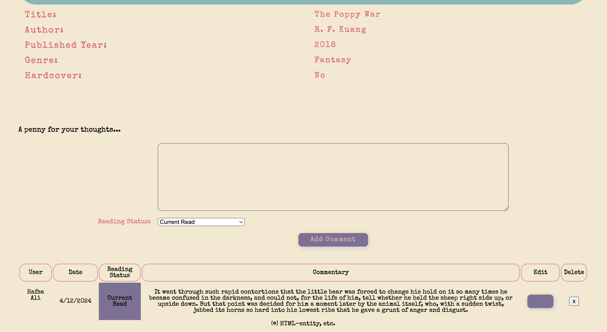

# Readaway

## Readaways Purpose

1) Simple Experience: This interface is easy to use, so you can focus on expressing your bookish thoughts without hassle.
2) Fun and Informal: This isn't your typical book review platform. It's a place to have fun, share insights, and geek out over books together.
3) Community Vibes: Join a community of passionate readers who understand the joy of getting lost in a good book.

## Readaway Screenshots

## Technologies Used

- JavaScript
- HTML
- CSS
- Git Hub
- Node.js
- Express
- MongoDB
- Mongoose

## Project Planning:
Upon identifying the project concept, I developed multiple schemas to accurately represent the data sets involved. Mapping out the schema relationships, I utilized Trello as a project management tool to define and monitor AAU stories. This framework facilitated the implementation of CRUD operations and foundational authorization protocols, ensuring a robust and secure system architecture.

## Heroku Link 

[Click here to access Readaway](https://readaway-abe65a6d0887.herokuapp.com/)

## What can Users do?
1) Add and Remove a Book.

2) Add, Update and Remove their notes/comments on a Book.

3) Give a status update on their journey with the Book.

4) Read other User's comments/notes on a Book.

# Next Steps
1) User's creating their own list of books accessible only to them

2) Possible using API to generate a book through a search tool

3) Improve CSS and overall user experience 